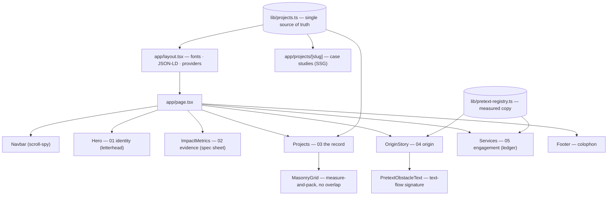

# VECTOR384 — Systems Engineering Portfolio

**A portfolio built like an engineering dossier — [vector384.com](https://vector384.com) — LCP 48 ms, CLS 0, zero client-side blocking on the largest paint.**

The portfolio of **Rudra Mahapatro**, a systems engineer working in Rust, C++, offensive security, and algorithmic trading. It leads with _evidence_ — real repos and reproducible benchmarks — instead of decoration. The design is deliberately restrained: flat surfaces, one accent colour, and typography doing the work, so the engineering identity reads as credible rather than templated.

## Live

- **Production:** [vector384.com](https://vector384.com) (deployed on Vercel from `main`)
- **Benchmarks (reproducible):** [/benchmarks](https://vector384.com/benchmarks)

## Performance

Measured on a local production build (`next start`) via headless Chromium:

| Metric                         | Value                                                     | "Good" threshold |
| ------------------------------ | --------------------------------------------------------- | ---------------- |
| LCP (Largest Contentful Paint) | **48 ms** — the hero headline, static in the initial HTML | < 2.5 s          |
| CLS (Cumulative Layout Shift)  | **0** — masonry reserves its height; nothing jumps        | < 0.1            |
| FCP (First Contentful Paint)   | **48 ms**                                                 | < 1.8 s          |
| TTFB                           | **8 ms**                                                  | —                |

The LCP element is text, painted from server-rendered HTML with `display: swap` fonts — no JavaScript gates the largest paint. The masonry grid measures real card heights before positioning, so there is no reflow when it hydrates.

## Architecture



**Information architecture** follows dossier logic — claim, then proof, then the work:
`01 identity → 02 evidence → 03 the record → 04 origin → 05 engagement`.

## Quick start

Single command (Bun is the package manager — `bun`, not `npm`):

```bash
bun install && bun dev      # http://localhost:3000
```

```bash
bun run build && bun start  # production build
bun run typecheck           # tsc --noEmit
```

## How it works

**Stack** — Next.js 16 (App Router) · React 19 · TypeScript (strict) · Tailwind CSS 3 · Framer Motion · Lenis (smooth scroll) · `@chenglou/pretext` (text-layout engine) · deployed on Vercel.

**Design system** — a flat "editorial dossier" language, defined in `app/globals.css` and `tailwind.config.ts`:

- **Palette:** amber `#E5A537` (annotation ink, ~one per viewport) + cyan `#3FBDD4` (reserved for verification/evidence links) on a blue-black base ramp `#0E1018 → #2E3444`.
- **Type:** Syne (display, ≥ 22 px), Sora (body), Space Mono (all numbers, labels, commands — so figures read as measured output).
- **Surfaces:** hairline borders and flat panels — no glassmorphism, no glow, radius ≤ 2 px.
- **Named type tokens** (`text-display`, `text-spec-value`, `text-caption`, `border-hairline`) keep the system self-documenting and enforceable.
- **Motion:** three intentional primitives (`Reveal`, `RuleDraw`, `Stagger`) in `components/motion.tsx`, all honouring `prefers-reduced-motion` via `<MotionConfig reducedMotion="user">`.

**The signature** — in the Origin section ("The Path"), body text flows pixel-precisely around the stack-inventory figure using the `pretext` engine (`components/pretext/*`). It is the one bespoke typographic moment, presented as a captioned figure.

**Data** — `lib/projects.ts` is the single source of truth for the project catalogue (grid, case-study routes, and JSON-LD). Each project's visibility is derived, not hand-flagged:

| `getVisibility()`       | Card badge                     |
| ----------------------- | ------------------------------ |
| has a public repo       | `source ↗` (cyan)              |
| shipping                | `source: shipping soon`        |
| NSE Trading Engine only | `restricted — case study only` |

Long-form copy lives in `lib/pretext-registry.ts` (the single registry consumed for both rendering and pretext measurement).

## Project structure

```
app/
  layout.tsx            fonts, SEO metadata, JSON-LD, providers
  page.tsx              home — composes the section flow
  globals.css           the flat design-system component layer
  projects/[slug]/      case studies (SSG from lib/projects.ts)
  benchmarks/           reproducible FlashAudit vs. Gitleaks methodology
  writing/              Substack mirror (ISR, daily revalidate)
components/
  Hero, ImpactMetrics, Projects, OriginStory, Services, Footer, Navbar
  SectionShell          12-col dossier grid + margin rail
  SpecTable             ruled label/value/note rows
  EvidenceFigure        captioned technical-exhibit frame
  MasonryGrid           measure-and-pack masonry
  motion.tsx            MotionProvider + Reveal + RuleDraw + Stagger
  pretext/              text-flow-around-obstacle engine (the signature)
lib/
  projects.ts           project catalogue — single source of truth
  pretext-registry.ts   measured long-form copy
```

## Deployment

Vercel builds and deploys the `main` branch to production automatically. Feature branches get isolated preview deployments. Security headers (CSP report-only, HSTS, frame-deny) and caching are configured in `next.config.js`.
